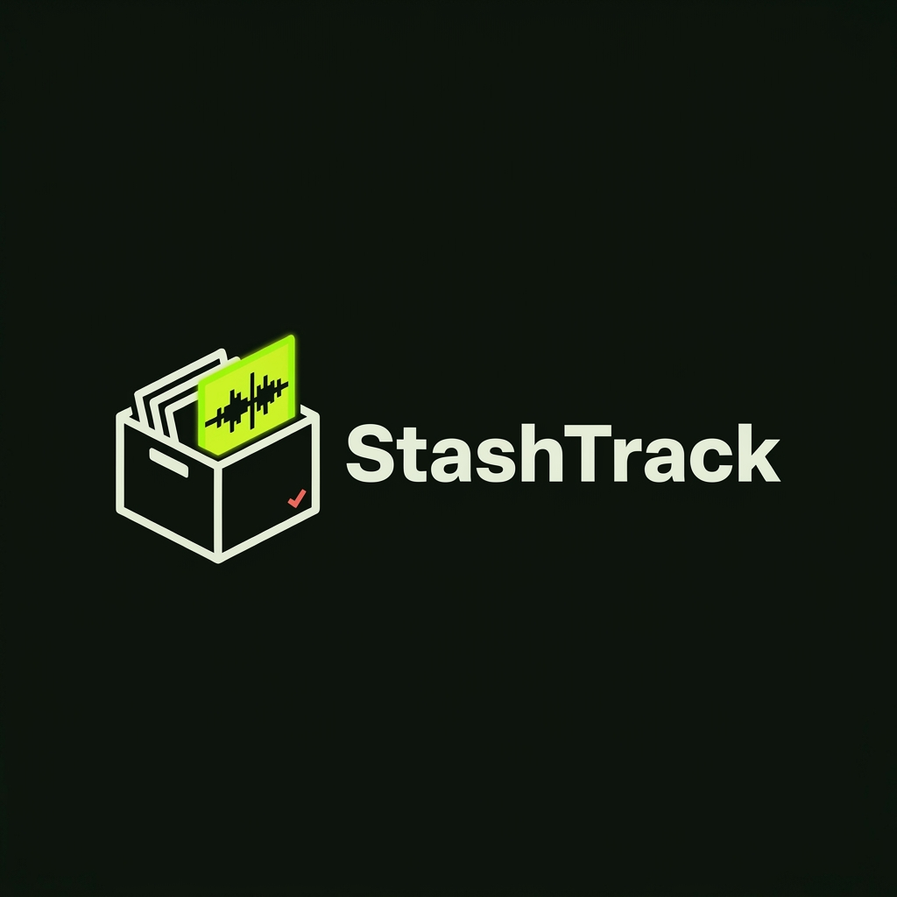

<p align="center">
  
</p>

<h1 align="center">StashTrack JUCE Plug-in</h1>

<p align="center">
  <strong>Sample the web from inside your DAW.</strong><br/>
  Paste a URL, clip the range, watch it render, drag the waveform straight into your playlist.
</p>

<p align="center">
  <a href="https://stashtrack.n9records.com/download/windows"></a>
  <a href="https://stashtrack.n9records.com/download/macos"></a>
  <a href="https://stashtrack.n9records.com/download/linux"></a>
  <a href="https://github.com/N9RecordsTechnologiesIL/StashTrack/actions/workflows/ci.yml"></a>
</p>

---

StashTrack is a VST3 that downloads the section you want from any
yt-dlp-supported URL, renders a clean WAV with a waveform preview inside the
plugin, and hands it to your DAW as a **native OS file drag** — the same drop
FL Studio would receive from Explorer. Its entire UI is a React + TypeScript
app rendered natively (no webview) by the [VSReacT](https://github.com/N9RecordsTechnologiesIL/VSReacT) engine.

## Metadata

Publisher: N9 Records
Website: https://stashtrack.n9records.com
Support: vsts@n9records.com
Version: v0.8.1
Copyright: Copyright (c) 2026 N9 Records
License: StashTrack Non-Commercial License v0.1. Free to use, copy, modify, and share for non-commercial purposes only. No commercial use or profit is allowed.

## Features

- **URL → WAV → playlist** in one motion: paste, download, drag. No export dialogs.
- **Clip before you download** — mark start/end (`30`, `1:23`, `2:14:05.5`); segment
  streams mean a 2-hour set gives up its 15 seconds in seconds.
- **Live progress** — the bar under the URL shows real yt-dlp percentages.
- **Preview playback** — play/pause through the plugin output, scrub the bar
  under the waveform, watch the playhead track across it.
- **The Stash** — your last 50 downloads in a sliding drawer; click any entry
  to reload it for preview and drag.
- **Auto-updates** — checks GitHub on open. Windows installs in place;
  macOS/Linux are pointed at the right download for their platform.
- **A UI that feels like 2026** — splash screen, animated knob-grade controls,
  hover states everywhere; written in React, painted by C++ at 60fps.

## Install

Grab the latest build for your platform from
[stashtrack.n9records.com](https://stashtrack.n9records.com) or the
[releases page](https://github.com/N9RecordsTechnologiesIL/StashTrack/releases/latest):

| Platform | Package | Notes |
|---|---|---|
| **Windows** | `StashTrackSetup.exe` | Bundles yt-dlp, ffmpeg, Deno, uv/uvx, and the VC++ runtime — a fresh PC needs nothing else. Installs to the system VST3 folder. |
| **macOS** | `StashTrack-macOS.pkg` | Installs to `/Library/Audio/Plug-Ins/VST3`. Currently **unsigned** (no Apple Developer ID yet): right-click the .pkg → Open, or allow it under Privacy & Security. Install tools with `brew install yt-dlp ffmpeg`. |
| **Linux** | `StashTrack-linux-x86_64.tar.gz` | Run `./install.sh` (installs to `~/.vst3`). Needs `ffmpeg` and `yt-dlp` on PATH. |

> **Legal notice:** downloading content may violate a site's Terms of Service
> or copyright law. Only download content you own, have licensed, or otherwise
> have the rights to use.

## Building from source

Requires CMake 3.22+, a C++17 toolchain, [JUCE](https://github.com/juce-framework/JUCE),
[Bun](https://bun.sh), and a checkout of the
[VSReacT](https://github.com/N9RecordsTechnologiesIL/VSReacT) framework as the
parent directory (this repo nests inside it — see its README).

```powershell
# UI bundle
cd jsui-vsreact
bun install
bun run build

# Plugin (Windows; see .github/workflows for macOS/Linux invocations)
cmake -S . -B build-vs -G "Visual Studio 17 2022" -A x64 -DJUCE_SOURCE_DIR=path/to/JUCE
cmake --build build-vs --target StashTrack_VST3 --config Release
ctest --test-dir build-vs -C Release --output-on-failure
```

Dev builds (`-DSTASHTRACK_VSREACT_DEV=ON`, the default) **hot-reload** the UI:
rebuild the bundle while the plugin is open and it remounts in place — no DAW
restart. Release/installer builds embed the bundle in the binary.

The Windows installer is produced by
`installer/windows/build-installer.ps1`; macOS/Linux packages by the scripts
under `installer/macos` and `installer/linux`. All three are built and
attached to releases automatically by `.github/workflows/release.yml` when a
`v*` tag is pushed.

## Repository layout

- `Source/` — processor (preview transport), editor (VSReacT host + native
  waveform drag), download/update/history utilities.
- `jsui-vsreact/` — the React + TypeScript UI app.
- `stashtrack-landing/` — the product site (Next.js on Render).
- `installer/` — per-platform packaging.
- `Tools/` — `UiProbe` (offscreen UI verification with synthetic input) and
  `DownloadProbe` (live yt-dlp progress smoke test).
- `Tests/` — download/packaging test suites (run via CTest).

## License

StashTrack's original code and materials are under the
[StashTrack Non-Commercial License v0.1](LICENSE.md) — free to use, copy,
modify, and share for non-commercial purposes; no commercial use or profit
without written permission from N9 Records. Third-party dependencies keep
their own licenses.
